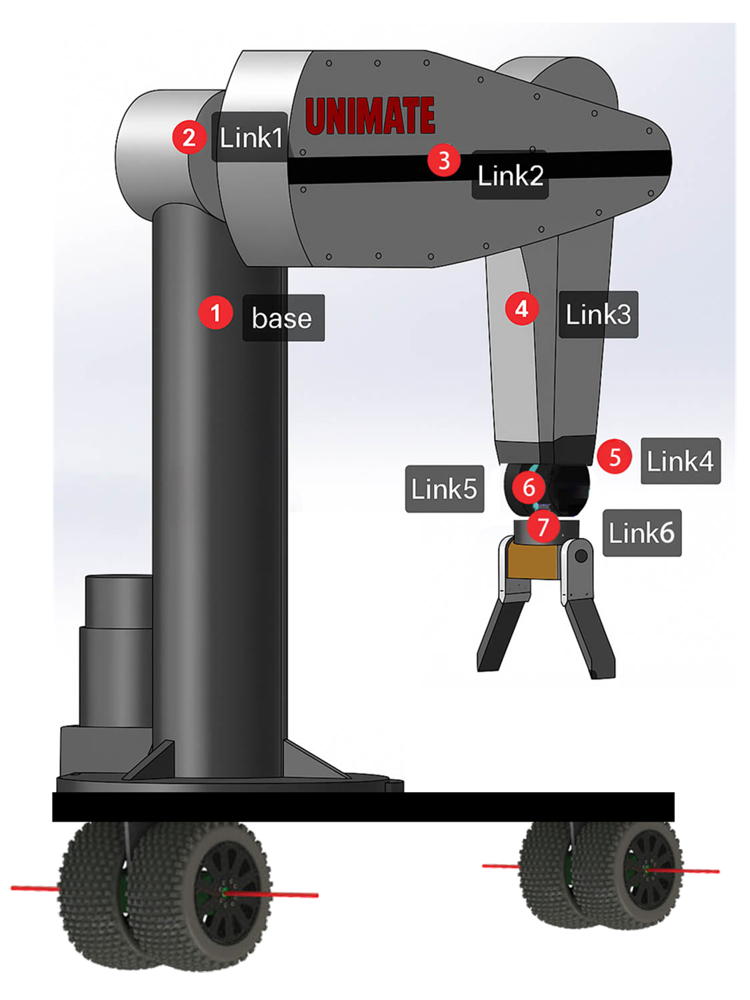
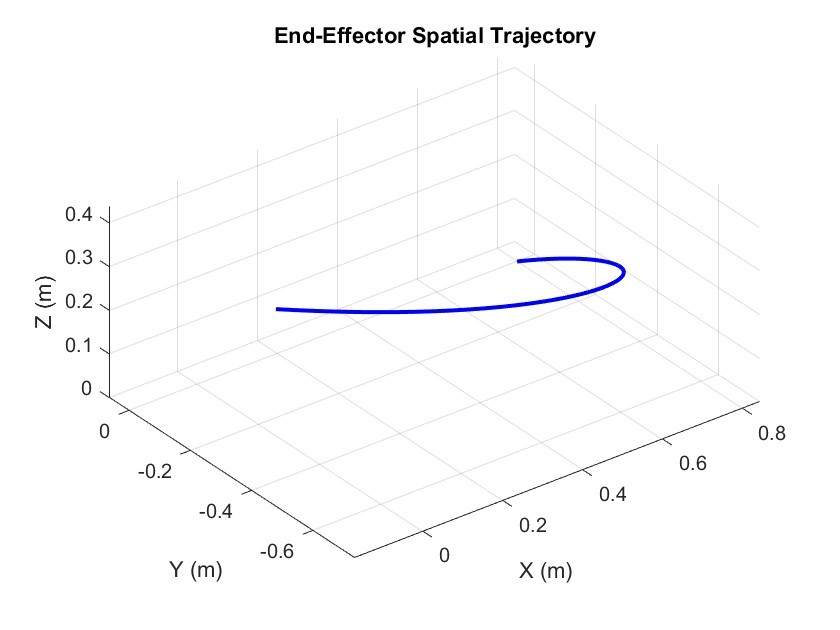

# Autonomous Robotic System for Hazardous Environments

This repository contains the design, modeling, and simulation of an autonomous robotic system capable of performing door unlocking and valve manipulation tasks in hazardous environments. The project is inspired by the DARPA Robotics Challenge (DRC) and addresses limitations in mobility, manipulation, and autonomy in constrained spaces.

## Tasks

### Task 1: Door Unlocking and Opening
### Task 2: Valve Manipulation

## Overview

Our proposed robotic system features:
- Hybrid leg-wheel chassis for mobility in constrained environments
- 6-DOF manipulator for dexterous tasks
- Two-finger adaptive end-effector for precise manipulation
- Advanced sensing and perception systems

## Key Features

### Mechanical Design
- Hybrid quadrupedal-wheeled base inspired by state-of-the-art platforms like MOMARO and RoboSimian
- 6-DOF manipulator arm based on the PUMA560 design
- Custom two-finger adaptive end-effector for diverse manipulation tasks

### Kinematics & Control
- Forward and inverse kinematics implementation
- Trajectory planning in joint and Cartesian spaces
- Task-specific motion sequences for door opening and valve manipulation

### Simulation Results
The system successfully demonstrates:
- Autonomous door unlocking and opening
- 360° valve rotation manipulation
- Smooth trajectory planning and execution

## Future Work
- Physical prototyping and real-world testing
- Extension to additional tasks (drywall cutting, stair climbing)
- Enhanced perception and autonomy in degraded environments

## Contributors
- Xinyu Bai
- Yichen Liu
- Yichen Kang
- Yanchun Zhang
- Jun Wu

## Acknowledgments
This project was developed as part of EESM6000A: Modern Robotics: Theory, Development and Case Study (Spring 2025) at The Hong Kong University of Science and Technology.
